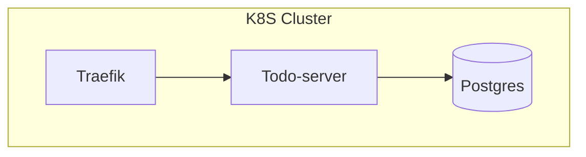

# Monorepo of TODO App

A fully working example of Todo App to demonstrate adoption of Domain Driven Development and Clean Architecture

## Features

- Basics CRUD of the Todo Domain
- Boostraping application dependencies like ingress gateway, database


## System Overview



## Application Architecture


## Getting Started

### Install & Configure Development Tools (Prerequisites)
- NodeJS (Required for working with our Monorepo tool)
  - https://nodejs.org/en/download/ (Tested with v20.14.x)
- PNpm (A package manager for NodeJS dependencies)
  - https://pnpm.io/installation (Tested with v9.2.x)
- Go (Tested with v1.21.x)
  - https://go.dev/doc/install
- Docker Desktop (Required for our system to run with docker)
  - https://docs.docker.com/desktop/install/mac-install/
- Install k3d (Required for bootstrapping k8s cluster)
  - https://k3d.io/
- Install Devspace (Required for manage local k8s development)
  - https://www.devspace.sh/docs/getting-started/installation
- Helm (A k8s manifest management tool)
  - https://helm.sh/docs/intro/install/

### How to setup the repo (Perform under repo root folder)

```bash
$ pnpm install
```

### How to test (Perform under repo root folder)

```bash
$ npx nx test todo-server
```

### How to run in a local environment (Perform under repo root folder)

1. Boostrap a k8s cluster locally
```bash
$ pnpm run cluster:init
```

2. Deploy infra and todo server to the local k8s cluster
```bash
$ npx nx deploy-local todo-server --configuration=full
```

3. Wait ~30 seconds for k8s to deploy the first time, then curl to validate if todo-server is UP and ready
```bash
curl -X 'GET' \
  'http://localhost:30080/todo/todos' \
  -H 'accept: application/json'
```

4. Browse http://localhost:30080/todo/openapi for API documentation


### How to clean up (Perform under repo root folder)

```bash
$ pnpm run cluster:cleanup
```
